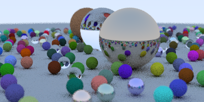

# roju_tracer
A ray tracing thing with the help of [Ray Tracing in a Weekend](http://www.realtimerendering.com/raytracing/Ray%20Tracing%20in%20a%20Weekend.pdf). My goal when making this project was to learn about threading in a more hands on way, as I hadn't used it too much. So basically trying to optimize the program from the book with threading. A further improvement would be to use SIMD to improve performance even more


## Render result


This render takes approximately 0.9s to complete on Manjaro Linux with a 12 core Intel i7-3930K @ 3.800GHz with a Release build. See [`config.cpp`](src/config.cpp) for details on resolution and bounce counts etc.


## Compiling
The project is structured in a "unity build" sort of way, so everything is just included in `main.cpp`, except for SDL2, which needs to be linked against separately.

Preferred way to build is to use the provided [CMake](https://cmake.org/) files for generating projects or makefiles for each platform. For faster runtime, make sure to use a Release build. For example compiling on Linux would look something like:
```
mkdir bin-release
cd bin-release
cmake .. -DCMAKE_BUILD_TYPE=Release
make
```

Currently this program is only tested on Linux, but should in theory work on Windows and OSX as well.


## Dependencies
- [SDL2](http://libsdl.org/) cmake will automatically build this from source (included in deps folder)
- C/C++ runtime libraries, hopefully shipped with your dev environment.

Following are single-ish header libraries, so they don't require any specific actions really. These are all already included in the main.cpp
- [HandmadeMath](https://github.com/HandmadeMath/Handmade-Math)
- [stb_image_write](https://github.com/nothings/stb)
- [PCG Random Number Generator C++ library](https://github.com/imneme/pcg-cpp)

